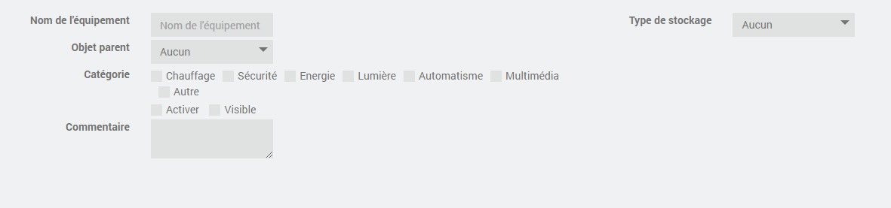
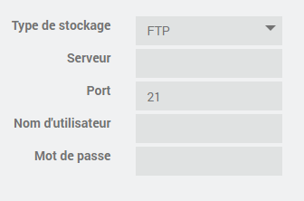
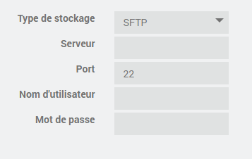
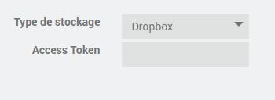
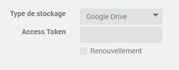
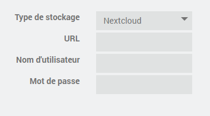

Synchronisation et transfert de fichiers entre différents services de stockage cloud et systèmes de fichiers locaux.

Présentation Cloudsyncpro
=========================
Rclone est un outil de ligne de commande open-source qui permet de synchroniser et de transférer des fichiers entre différents services de stockage cloud et systèmes de fichiers locaux. Il supporte un grand nombre de services de stockage cloud populaires, comme Google Drive, Dropbox, Amazon S3, Microsoft OneDrive, et bien d'autres encore. Il est très utile pour sauvegarder des fichiers, synchroniser des données entre différents services, ou transférer des fichiers volumineux à travers internet.

Ce plugin permet d'interfacer cet outil avec Jeedom et simplifier la configuration des services de stockage en ligne.

Installation et activation du plugin
====================================

Voici les étapes pour installer le plugin cloudsyncpro :

1. Accédez à l'interface d'administration de votre Jeedom en ouvrant votre navigateur web.
2. Connectez-vous à votre compte Jeedom.
3. Cliquez sur "Plugin" dans le menu de gauche.
4. Cliquez sur "Gestion des plugins".
5. Cliquez sur "Market".
6. Recherchez le plugin cloudsyncpro et cliquez dessus.
7. Cliquez sur "Installer stable/beta".

Voici les étapes pour activer/configurer le plugin cloudsyncpro :

1. Cliquez sur "Plugin" dans le menu de gauche.
2. Cliquez sur "Gestion des plugins".
3. Recherchez le plugin que vous souhaitez activer dans la liste des plugins installés.
4. Cliquez sur l'icône "Activer" à droite du nom du plugin.
5. Cliquez sur le bouton "Installer les dépendances" situé à droite du nom du plugin.
6. Les dépendances du plugin vont s'installer automatiquement. Ce processus peut prendre plusieurs minutes en fonction de la vitesse de votre connexion internet et de la puissance de votre Jeedom.
7. Une fois que l'installation des dépendances est terminée, vous pouvez configurer et utiliser le plugin normalement.

Configuration des équipements
=============================

Onglet Equipement
-----------------

-   **Nom de l’équipement** : Nom de votre service de stockage

-   **Objet parent** : Indique l’objet parent auquel appartient l’équipement

-   **Activer** : Permet de rendre votre équipement actif

-   **Visible** : Rend votre équipement visible sur le dashboard

-   **Commentaire** : Champ de texte libre

-   **Type de stockage** : Type de votre service de stockage

Onglet Commandes
----------------

Services de stockage
====================

FTP
---

FTP (File Transfer Protocol) est un protocole de communication utilisé pour transférer des fichiers entre un client et un serveur sur un réseau informatique. Il permet à un utilisateur d'accéder à un serveur distant, d'afficher la structure de fichiers du serveur et de télécharger ou de téléverser des fichiers.
FTP utilise un système d'authentification pour permettre l'accès au serveur. Les utilisateurs doivent fournir un nom d'utilisateur et un mot de passe pour accéder au serveur.

SFTP
----

SFTP signifie Secure File Transfer Protocol (Protocole de transfert de fichiers sécurisé en français). C'est un protocole de transfert de fichiers sécurisé qui utilise une couche de sécurité supplémentaire pour protéger les données en transit.
Contrairement au protocole FTP standard, qui est vulnérable aux interceptions de données et aux attaques par reniflage de paquets, SFTP chiffre toutes les données qui sont transférées entre le client et le serveur, en utilisant un chiffrement basé sur SSH (Secure Shell). Cela rend le protocole SFTP plus sûr et plus fiable pour les transferts de fichiers, surtout si les fichiers contiennent des informations sensibles.
SFTP utilise également un système d'authentification pour permettre l'accès au serveur. Les utilisateurs doivent fournir un nom d'utilisateur et un mot de passe pour accéder au serveur, tout comme dans le protocole FTP standard.

Dropbox
-------

Dropbox est un service de stockage en ligne (ou "cloud storage" en anglais) qui permet aux utilisateurs de stocker, synchroniser et partager des fichiers et des dossiers en ligne. Il a été lancé en 2007 par la société Dropbox Inc.
Le service Dropbox permet de stocker des fichiers sur des serveurs distants et de les synchroniser automatiquement sur plusieurs appareils, tels que des ordinateurs de bureau, des ordinateurs portables, des smartphones et des tablettes. Les fichiers sont accessibles à partir de n'importe quel appareil connecté à Internet, ce qui facilite leur accès et leur partage.

Google Drive
------------

Google Drive est un service de stockage en ligne (ou "cloud storage" en anglais) créé par Google en 2012. Il permet aux utilisateurs de stocker, synchroniser et partager des fichiers et des dossiers en ligne.
Avec Google Drive, les utilisateurs peuvent stocker des fichiers sur des serveurs distants et y accéder à partir de n'importe quel appareil connecté à Internet, comme un ordinateur de bureau, un ordinateur portable, un smartphone ou une tablette. Les fichiers sont synchronisés automatiquement sur tous les appareils, ce qui facilite leur accès et leur partage.

Nextcloud
---------

Nextcloud est un logiciel libre de stockage et de partage de fichiers en ligne, qui permet aux utilisateurs de stocker, synchroniser et partager des fichiers et des dossiers en ligne, tout en gardant le contrôle de leurs données.
Nextcloud est une alternative auto-hébergée à des services de stockage en ligne commerciaux tels que Dropbox, Google Drive ou OneDrive. Il permet aux utilisateurs de stocker des fichiers sur leur propre serveur ou sur un serveur de cloud computing tiers. Les fichiers peuvent être synchronisés automatiquement sur plusieurs appareils, tels que des ordinateurs de bureau, des ordinateurs portables, des smartphones et des tablettes.
Nextcloud est open source et peut être téléchargé gratuitement sur leur site officiel.

OneDrive
--------

OneDrive est un service de stockage en ligne de fichiers créé par Microsoft en 2007. Il permet aux utilisateurs de stocker des fichiers et des dossiers en ligne, de les synchroniser sur plusieurs appareils et de les partager avec d'autres personnes.
OneDrive offre aux utilisateurs un espace de stockage en ligne gratuit de 5 Go, qui peut être étendu en achetant un abonnement payant pour un stockage supplémentaire. Les utilisateurs peuvent accéder à leurs fichiers stockés sur OneDrive à partir de n'importe quel appareil connecté à Internet, y compris des ordinateurs, des smartphones et des tablettes.

pCloud
------

pCloud est un service de stockage en ligne de fichiers lancé en 2013. Il permet aux utilisateurs de stocker, de synchroniser et de partager des fichiers en ligne, tout en garantissant la sécurité et la confidentialité des données.
pCloud offre un espace de stockage gratuit de 10 Go pour les nouveaux utilisateurs, qui peut être étendu en achetant un abonnement payant pour un stockage supplémentaire. Les utilisateurs peuvent accéder à leurs fichiers stockés sur pCloud à partir de n'importe quel appareil connecté à Internet, y compris des ordinateurs, des smartphones et des tablettes.
pCloud utilise une technologie de chiffrement de bout en bout pour garantir la sécurité et la confidentialité des données. Les fichiers sont stockés sur des serveurs dans des centres de données sécurisés en Suisse, ce qui garantit une protection supplémentaire pour les données des utilisateurs.

kDrive
------

kDrive est un service de stockage en ligne de fichiers lancé par la société suisse Infomaniak. Il permet aux utilisateurs de stocker, de synchroniser et de partager des fichiers en ligne, tout en garantissant la sécurité et la confidentialité des données.
kDrive offre un espace de stockage en ligne gratuit de 1 Go pour les nouveaux utilisateurs, qui peut être étendu en achetant un abonnement payant pour un stockage supplémentaire. Les utilisateurs peuvent accéder à leurs fichiers stockés sur kDrive à partir de n'importe quel appareil connecté à Internet, y compris des ordinateurs, des smartphones et des tablettes.
kDrive utilise une technologie de chiffrement de bout en bout pour garantir la sécurité et la confidentialité des données. Les fichiers sont stockés sur des serveurs en Suisse, ce qui garantit une protection supplémentaire pour les données des utilisateurs.

FAQ
===
