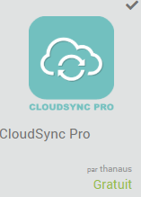
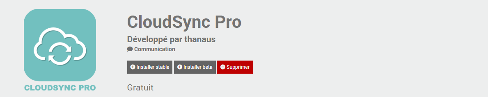
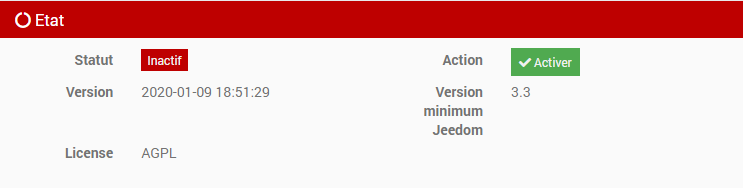
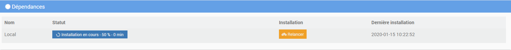
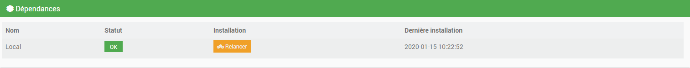

Synchronisation fichiers vers des services de stockage en ligne (Dropbox, Google Cloud Storage, Nextcloud) mais aussi système de fichier local, serveurs (S)FTP

Présentation Cloudsyncpro
=========================
Dans le domaine de la synchronisation de fichiers, il existe un outil multiplateforme et largement utilisé : rsync.
On trouve aussi nombre d'outils qui se reposent sur rsync pour la gestion de la synchronisation, qui n'est qu'une de leurs multiples fonctionnalités.
C'est notamment le cas de Rclone, qui est un dérivé créé par Nick Craig-Wood. Open source, son code est disponible sous licence MIT et diffusé via GitHub. Sa fonctionnalité principale est d'accéder à des services de stockage en ligne mais il faut par contre être un adepte de la ligne de commande.

Ce plugin permet d'interfacer cet outil avec Jeedom et simplifier la configuration des services de stockage en ligne.

Installation et activation du plugin Cloudsyncpro
=================================================

Le plugin Cloudsyncpro doit être installé via le market Jeedom.

 

Une fois le plugin installé, il suffit de l’activer en cliquant sur "Activer".

Installation des dépendances
----------------------------

Les dépendances sont installées automatiquement par Jeedom dans les 5 min. Elles seront également réinstallées lors d'une mise à jour du plugin si besoin.

Mise à jour manuelle des dépendances
------------------------------------

Pour mettre à jour manuellement les dépendances, il faut cliquer sur "Relancer".

Fichiers LOG
------------

Configuration
=============

Une fois le plugin installé, il vous faut lancer les dépendances puis configurer un équipement spécifique au service de stockage en ligne ou serveur (S)FTP sur lequel vous souhaitez synchroniser vos fichiers.
Pour information, les dépendances sont installées automatiquement par Jeedom dans les 5 min. Elles seront également réinstallées lors d’une mise à jour du plugin si besoin.

Voici la liste des commandes disponibles pour chaque équipement :

* Copie (source vers destination)
* Synchronisation (source vers destination)
* Liste (destination)
* Suppression (destination)
* Purge (destination)

4 options sont disponibles pour chaque commande afin de sélectionner précisemment des fichiers :

* Inclusion des fichiers
* Exclusion des fichiers
* Ancienneté (minimum)
* Ancienneté (maximum)

Commandes
---------

* Copie (source vers destination)

La commande '**copie**' permet de transférer les nouveaux fichiers ainsi que les fichiers modifiés depuis le lancement de la dernière commande. Les fichiers supprimés à la source ne sont PAS supprimés à la destination.

* Synchronisation (source vers destination)

La commande '**synchronisation**' permet d'avoir une réplique exacte des données à la source sur la destination. Cette commande permet de transférer les nouveaux fichiers ainsi que les fichiers modifiés depuis le lancement de la dernière commande.
Les fichiers supprimés à la source sont AUSSI supprimés à la destination.

* Liste (destination)

La commande '**liste**' permet de récupérer la liste des fichiers sur la destination

* Suppression (destination)

La commande '**suppression**' permet de supprimer des fichiers sur la destination

* Purge (destination)

La commande '**purge**' permet de supprimer les fichiers dans la poubelle et/ou le versionning des fichiers afin de libérer de l'espace sur le stockage.

Options
-------

* Inclusion des fichiers

* Exclusion des fichiers

* Ancienneté (minimum)

* Ancienneté (maximum)

FTP
===

SFTP
====

Dropbox
=======

Google Drive
============

Nextcloud
=========

Local
=====

FAQ
===
