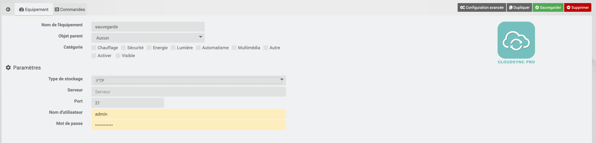
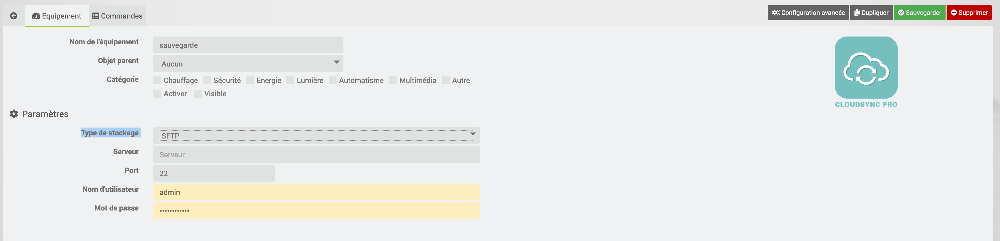
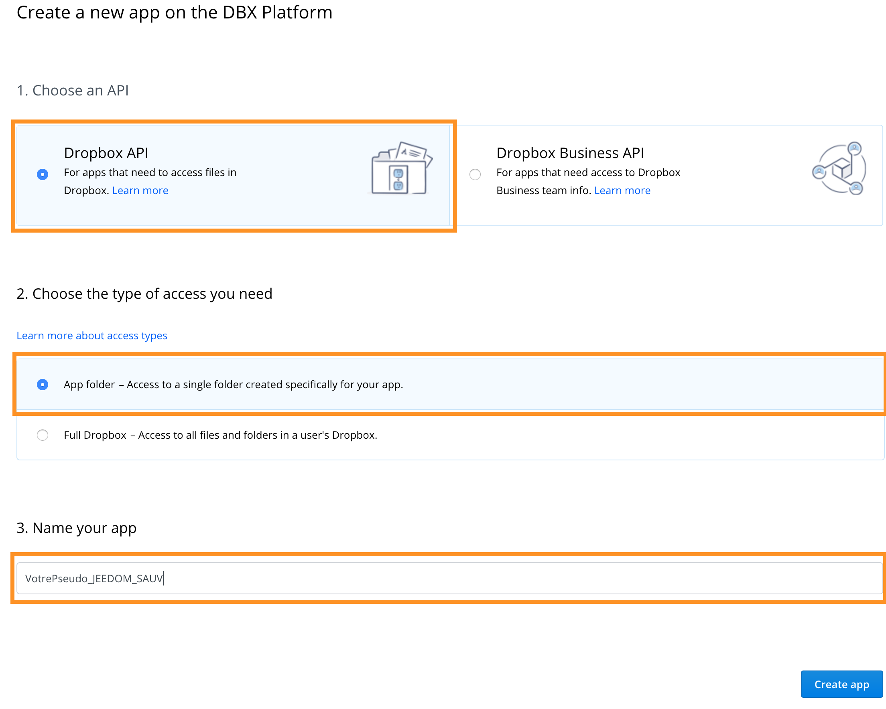
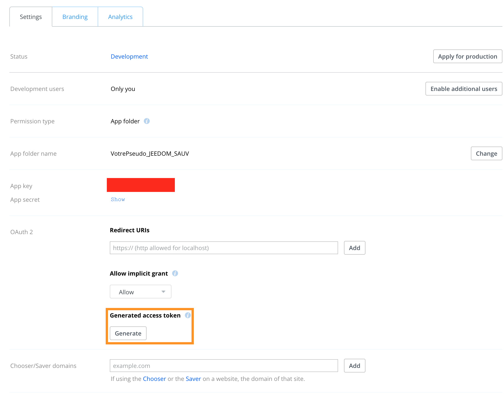
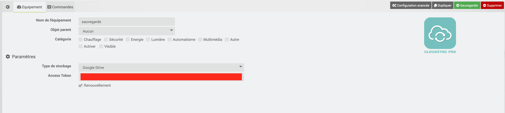
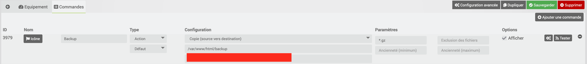
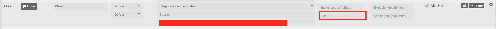
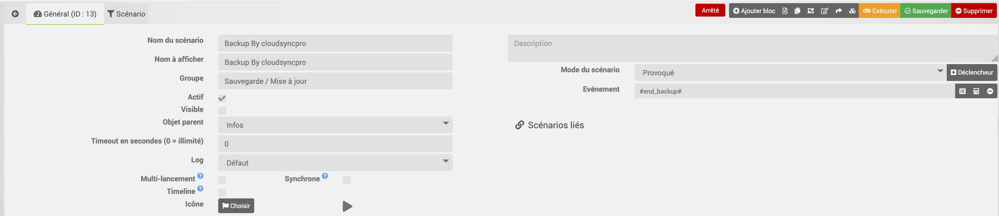
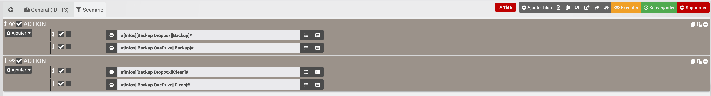

# Description

Outil de sauvegarde et de synchronisation de fichiers depuis votre installation Jeedom et plusieurs services de cloud publics. ATTENTION : le plugin ne supporte actuellement que FTP, SFTP, Local, Dropbox, Google Drive et NextCloud".

# Ajouter un équipement 
- Cliquer sur "Ajouter"
- Donner un nom à l'équipement (Exemple : Sauvegarde Jeedom)
- Cliquer sur OK

# Paramétrer une sauvegarde FTP
Dans l'onglet "Configuration"

- Sélectionner Type de stockage : FTP
- Indiquer l’adresse FTP de votre serveur, il peut être local mais aussi externe.
- Indiquer le Port FTP (par défaut 21)
- Indiquer le nom d'utilisateur du serveur FTP
- Indiquer le mot de passe du serveur FTP

# Paramétrer une sauvegarde SFTP
Dans l'onglet "Configuration"

- Sélectionner Type de stockage : SFTP
- Indiquer l’adresse SFTP de votre serveur, il peut être local mais aussi externe.
- Indiquer le Port SFTP (par défaut 22)
- Indiquer le nom d'utilisateur du serveur SFTP
- Indiquer le mot de passe du serveur SFTP

# Paramétrer une sauvegarde Dropbox
## Création d'un compte 
- Si vous n’avez pas de compte dropbox suivez le lien suivant pour en créer un.
<a href="https://db.tt/2rbL2XvvHz">https://db.tt/2rbL2XvvHz</a>

## Récupération du Token
- Pour commencer il va falloir créer une application dropbox afin de récupérer un token indispensable au plugin cloudsync  pro pour fonctionner

- Allez à l’adresse suivante <a href="https://www.dropbox.com/developers/apps">https://www.dropbox.com/developers/apps</a>
- Cliquer sur "Create app"

- Donner un nom à votre application (exemple VotrePseudo_JEEDOM_SAUV)
- Cocher "I agree …"
- Cliquer sur "Create App"
- Générer le token pour permettre à cloudsync pro de contacter votre application
- Copier le token

## Configuration
Dans l'onglet "Configuration"

- Sélectionner Type de stockage : DROPBOX
- Indiquer le token : Coller le token précédemment copier

# Paramétrer une sauvegarde Google Drive
## Récupération du Token
- cliquer sur l’URL suivante : <a href="https://accounts.google.com/o/oauth2/auth?access_type=offline&client_id=202264815644.apps.googleusercontent.com&redirect_uri=urn:ietf:wg:oauth:2.0:oob&response_type=code&scope=https://www.googleapis.com/auth/drive&state=93c2bae7de5afb19ed549fd7fa4831f4">https://accounts.google.com/</a>
- Indiquer son login a Google
- Indiquer son mot de passe
- Copier le Token
## Configuration
Dans l'onglet "Configuration"

- Sélectionner Type de stockage : Google Drive
- Indiquer le token : Coller le token précédemment copier
- Cocher Renouvellement : Cela permet à rclone de générer un token

# Paramétrer une sauvegarde NestCloud

# Paramétrer une sauvegarde Locale

# Ajouter les commandes sur l'équipement
Dans l'onglet "Commandes" 
## Ajouter une commande de Sauvegarde
- Cliquer sur "Ajouter une commande"
- Donner un nom à la commande (Exemple : Backup)

- Dans la partie configuration
    - Sélectionner "Copie (Source vers destination)
    - Indiquer la source : Dossier de sauvegarde local de Jeedom (Par défaut /var/www/html/backup)
    - Indiquer la destination : Dossier de destination
- Dans la partie Paramètres
    - Indiquer l'inclusion  des fichiers : mettre "*.gz"

## Ajouter une commande de Nettoyage
- Cliquer sur "Ajouter une commande"
- Donner un nom à la commande (Exemple : Clean)

- Dans la partie configuration
    - Indiquer la destination : Dossier de destination
- Dans la partie Paramètres
    - Indiquer Ancienneté (Minimum) : exemple 10d (pour garder 10 jours de sauvegarde)
        - s => secondes
        - m => minutes
        - h => heures
        - d => jours
        - w => semaine
        - M => mois
        - y => année

    
# Création Scenario
Automatisation de la sauvegarde 
- Dans la partie Général

    - Sélectionner le mode de scénario  : Provoqué
    - Indiquer le déclencheur : #end_backup# (ce déclencheur permet de déclencher le scénario à la fin de la sauvegarde automatique de jeedom.)
 
 - Dans la partie Scénario

    - Indiquer les commandes de sauvegardes et de nettoyage
    
# Troubleshotting
- Message d'erreur : Unable to write configuration file ‘/var/www/html/plugins/cloudsyncpro/core/config/rclone.conf’ 
> Ce message signifie que le répertoire config n’existe pas il faut donc le créer a la main. Vous pouvez utiliser le plugin jeexplorer, vous déplacer dans le répertoire plugins/cloudsyncpro/core/ et clique droit créer un nouveau répertoire que vous appelé config. refaite le test ça devrait passer.