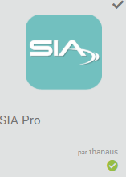
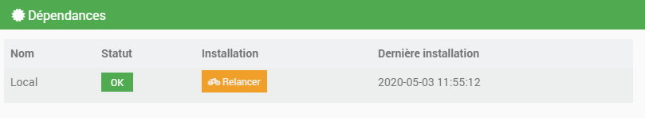

Une centrale d'alarme, via le protocole SIA, peut être raccordée en télésurveillance et transmettre ses événements à un centre de télésurveillance.

Présentation SIAPro
=========================
Le protocole SIA (norme ANSI/SIA DC-09-2007) a été établie par l'association "Security Industry Association" et décrit dans le document "SIA Digital Communication Standard - Internet Protocol Event Reporting". Ce protocole permet d'uniformiser les signaux d'alarmes IP quelque soit la centrale d'alarme sans aucune dépendance d'un fabricant/protocole propriétaire.

Ce plugin permet d'interfacer cette norme avec Jeedom.

Installation et activation du plugin
====================================

Le plugin SIApro doit être installé via le market Jeedom.

 

Une fois le plugin installé, il suffit de l’activer en cliquant sur "Activer".

XXXXXXXXXXXXXXXXXXInstallation des dépendances
----------------------------------------------

Les dépendances sont installées automatiquement par Jeedom dans les 5 min. Elles seront également réinstallées lors d'une mise à jour du plugin si besoin.

Mise à jour manuelle des dépendances
------------------------------------

Pour mettre à jour manuellement les dépendances, il faut cliquer sur "Relancer".

Configuration des équipements
=============================

Onglet Equipement
-----------------

-   **Nom de l’équipement** : Nom de votre service de stockage

-   **Objet parent** : Indique l’objet parent auquel appartient l’équipement

-   **Activer** : Permet de rendre votre équipement actif

-   **Visible** : Rend votre équipement visible sur le dashboard

-   **Commentaire** : Champ de texte libre

-   **Type de stockage** : Type de votre service de stockage

Onglet Commandes
----------------

Services de stockage
====================

FTP
---

File Transfer Protocol (protocole de transfert de fichier), ou FTP, est un protocole de communication destiné au partage de fichiers sur un réseau TCP/IP.

SFTP
----

SSH File Transfer Protocol (protocole de transfert de fichier), ou SFTP, est un protocole de communication fonctionnant au-dessus de SSH pour transférer et gérer des fichiers à distance.

Dropbox
-------

Dropbox est un service de stockage et de partage de copies de fichiers locaux en ligne proposé par Dropbox, Inc., entreprise localisée à San Francisco, en Californie.

Google Drive
------------

Google Drive ou Google Disque au Québec, est un service de stockage et de partage de fichiers dans le cloud lancé par la société Google.

Nextcloud
---------

Nextcloud est un logiciel libre, de site d'hébergement de fichiers, et un fork du logiciel ownCloud. À l'origine accessible via WebDAV, n'importe quel navigateur web, ou des clients spécialisés, son architecture ouverte a permis de voir ses fonctionnalités s'étendre depuis ses origines.

FAQ
===
