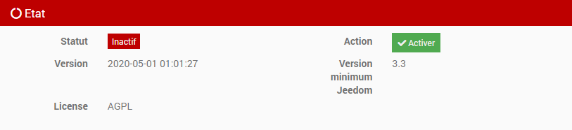
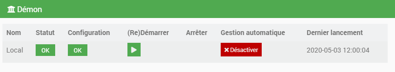
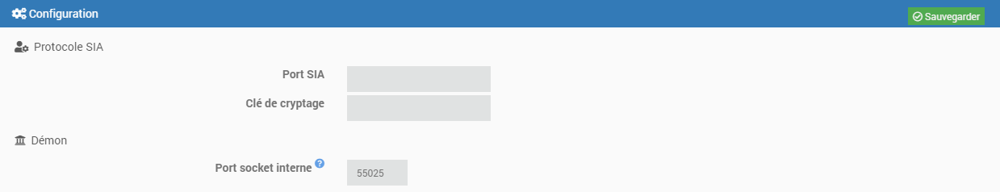

Une centrale d'alarme, via le protocole SIA, peut être raccordée en télésurveillance et transmettre ses événements à un centre de télésurveillance.

Présentation SIAPro
=========================
Le protocole SIA (norme ANSI/SIA DC-09-2007) a été établie par l'association "Security Industry Association" et décrit dans le document "SIA Digital Communication Standard - Internet Protocol Event Reporting".  
Ce protocole permet d'uniformiser les signaux d'alarmes IP quelque soit la centrale d'alarme sans aucune dépendance d'un fabricant/protocole propriétaire.

Ce plugin permet d'interfacer cette norme avec Jeedom.

Installation et activation du plugin
====================================

Le plugin SIApro doit être installé via le market Jeedom.

   

Une fois le plugin installé, il suffit de l’activer en cliquant sur "Activer".

Installation des dépendances
----------------------------------------------

Les dépendances sont installées automatiquement par Jeedom dans les 5 min. Elles seront également réinstallées lors d'une mise à jour du plugin si besoin.

Une fois les dépendances installées, le démon se lance (dans les 5 min). Si le statut n’est pas sur “OK”, il faut cliquer sur “(Re)Démarrer”.

Mise à jour manuelle des dépendances
------------------------------------

Pour mettre à jour manuellement les dépendances, il faut cliquer sur "Relancer".

Configuration du plugin
====================================

La configuration du plugin est extremement simple et lié aux informations indiquées dans la configuration de la centrale d'alarme (Port SIA et clé de cryptage).

-   **Port SIA** : Numéro du port du démon (réception/accusé de réception des trames SIA)

-   **Clé de cryptage** : Clé de cryptage (optionnel)

-   **Port socket interne** : Numéro de port non utilisé par le système (communication local démon vs Jeedom)

Configuration des équipements
=============================

Onglet Equipement
-----------------

-   **Nom de l’équipement** : Nom généré automatiquement après réception de la première trame SIA et modifiable par l'utilisateur

-   **Objet parent** : Indique l’objet parent auquel appartient l’équipement

-   **Activer** : Permet de rendre votre équipement actif

-   **Visible** : Rend votre équipement visible sur le dashboard

Onglet Commandes
----------------

FAQ
===
